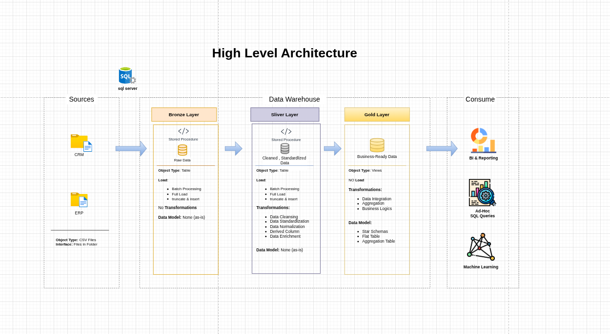

# 📊 Data Warehouse and Analytics Project

Welcome to the **Data Warehouse and Analytics Project** repository! 🚀

This project demonstrates a complete **end-to-end data warehousing and analytics solution**, from raw data ingestion to generating actionable business insights. It is designed as a **portfolio-ready project** showcasing industry best practices in **data engineering, modeling, and analytics**.

---

## 🏗️ Data Architecture

This project follows the **Medallion Architecture** approach using **Bronze**, **Silver**, and **Gold** layers:



### 🔹 Layers Explained

1. **Bronze Layer**

   - Stores raw data as-is from source systems
   - Data is ingested from CSV files into SQL Server
   - No transformations applied

2. **Silver Layer**

   - Data cleaning, validation, and standardization
   - Handles null values, duplicates, and inconsistencies
   - Prepares structured data for analysis

3. **Gold Layer**
   - Business-ready data modeled using **Star Schema**
   - Optimized for reporting and analytics
   - Includes fact and dimension tables

---

## 📖 Project Overview

This project covers:

- 🧱 **Data Architecture**  
  Designing a modern data warehouse using Medallion Architecture

- 🔄 **ETL Pipelines**  
  Extracting, transforming, and loading data from ERP & CRM systems

- 📐 **Data Modeling**  
  Building fact and dimension tables for analytical queries

- 📊 **Analytics & Reporting**  
  Writing SQL queries to generate insights and reports

---

## 🎯 Skills Demonstrated

This project highlights expertise in:

- SQL Development
- Data Engineering
- ETL Pipeline Design
- Data Modeling (Star Schema)
- Data Analytics

---

## 🛠️ Tools & Technologies

All tools used in this project are **free and open-source friendly**:

- **[Datasets](datasets/):** Project datasets (ERP & CRM CSV files)

- **Docker:** Run SQL Server container in Linux environment

- **Azure Data Studio:** Cross-platform database GUI (alternative to SSMS)

- **SQL Server (Docker Image):** Database engine for the warehouse

- **GitHub:** Version control and project collaboration

- **Draw.io:** Data architecture and schema design

- **Notion:** Project planning and task management

---

## 🐧 Environment Setup (Arch Linux + Docker + Azure Data Studio)

### 1️⃣ Install Docker

```bash
sudo pacman -S docker
sudo systemctl start docker
sudo systemctl enable docker
sudo usermod -aG docker $USER
```
